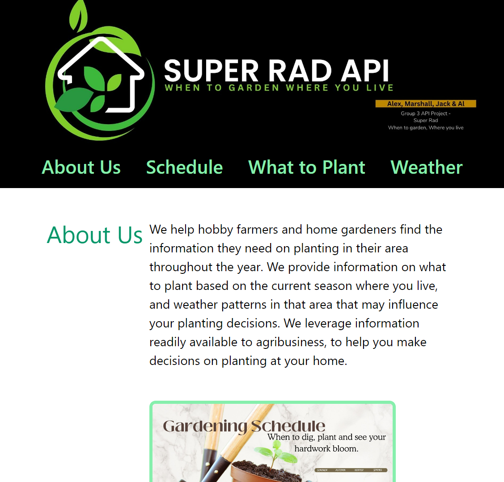

# Super Rad API

## Description

We have created a web application to assist hobby farmers and home gardeners to view planting information for their local area. Information provided to users includes what to plant based on current season, weather patterns and climate, using a localized weather API. The app will leverage information used for commercial ag to be accessible for hobby farmers and leisurely gardeners, making it easier for them to make decisions.

## Installation

N/A

## Usage

The application is easily navigatable via the home page.
- The 'What to Plant' page should allow you to filter for certain conditions or keywords and find a plant that interests you. Once located, you can save these plants to a list.
- The 'Schedule' page should allow you to input your location and view your saved plants. An idea for future development would be to allow the saving of these plants into a calendar based on best planting times.
- The 'Weather' page should allow you to view localised weather information for your area. An idea for future development would be for this page to make an assessment on whether there are suitable conditions for your saved plants to thrive where you live.
- 'More information' in the footer will take you to a detailed presentation for the application.

## Contributing

This assignment was a group project. We each worked out of our own branches, creating frequent pull requests to the main branch in Jack's repo.

## Credits

- Jack Leonard-Pekin: https://github.com/JLP-55
- Marshall Yung: https://github.com/markcheng1
- Al Ryan: https://github.com/alryan0812
- Alex Balsillie: https://github.com/abalsillie

## License

MIT License